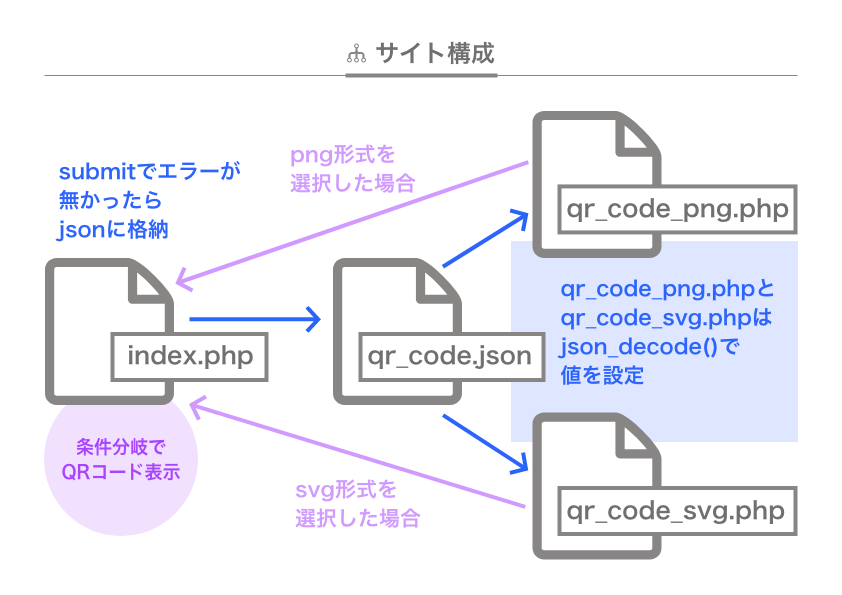

# qr_code
## QRコード生成システム
こちらのendroid/qr-codeのライブラリを使わせてもらいました。 https://github.com/endroid/qr-code

### <strong>概要</strong>

  

|ファイル・フォルダ |内容
|--|--
|index.php | TOPページ、入力・表示・DL
|qr_code_png.php |png画像生成
|qr_code_svg.php |svg生成
|qr_data.json |submitされた入力値を格納
|sanitize.css |サニタイズCSS
|style.css |メインCSS
|vendor |ライブラリフォルダ
|image |画像格納フォルダ

### <strong>注釈</strong>
submitは同ページでエラーチェックと値変換をしています。 
エラーが無かったら値をjsonに格納し、各QRコード生成ファイルにパラメータを挿入。 選択した画像形式のradioボタンで、QRコード表示画面とダウンロード先が変わるようif文で分岐しています。  
#### ・サイズについて
10pxくらいまでの数値が正確に取れないことがあります。コード本体や余白を1px単位でサイズ変更しても大きさが変わらないことがあります。 ただ全体サイズは正確です。  
カスタムサイズは内枠40px〜300pxまでの上限を設けました。 パネル枠を超えるとレイアウトが崩れるのと、スマホの場合は表示しきれないのが理由です。  
#### ・画像について
pngよりもsvgがシャープになります。小さいサイズになればなるほど差が顕著に出ます。 
### <strong>デモサイト</strong>
https://spica.okamechan.com/qrcode/

